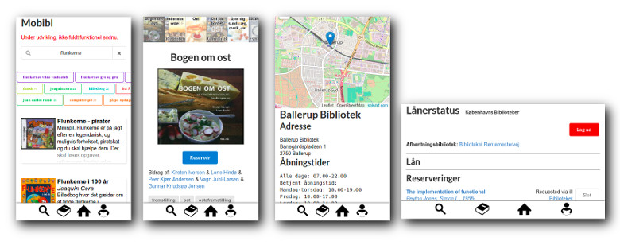

# MoBibl - Mobil App til Bibliotekerne

[In English below](#in-english)

Formålet med MoBibl er, at lave en open source app til bibliotekerne.

Vi er ved at lave en crowdfunding kampagne for den videre udvikling. 
Se [crowdfunding.md](https://github.com/solsort/mobibl/blob/master/crowdfunding.md) for detaljer.

Projektet ligger på github, og vi kører med 100% transparens omkring process og udvikling. Al kildekode lægges løbende her, - og projektstyring forgår via [github issues](https://github.com/solsort/mobibl/issues).  Klik på [Watch](https://github.com/solsort/mobibl/subscription) herover hvis du løbende vil følge med i udviklingen.

## Roadmap / plan 2017

- `April/Maj` Afklaringsfase. 
    - [Crowdfunding](https://github.com/solsort/mobibl/blob/master/crowdfunding.md) kampagne for videre udvikling.
    - Afklaring af funktionalitetskrav og ønsker fra bibliotekerne.
    - Afklaring af teknologiplatform bedst understøttet på tværs af leverandører og biblioteker med egenudvikling. (Det umiddelbare gæt, er at det er JavaScript/React, men det skal verificeres før end beslutning tages).
- `Maj/Juni/Juli` Implementation af grundfunktionalitet.
    - Designet baseres på DDB-app (når den frigives), som genbruges hvor det giver mening.
    - Kildekoden baseres på MoBibl og delvist DDB-app (når den frigives), som genbruges hvor det giver mening.
    - Udviklingen foregår agilt og transparent, med release hver 14. dag. Alle biblioteker har mulighed for at komme med løbende input til processen.
    - Fokus er en grund-applikation, som alle kan bygge videre på.
- `Juli/August/September` Videreudvikling
    - Implementation af features udover den kritiske grundfunktionalitet.
    - Buffer i tilfælde af uforudsete forsinkelser
    - Workshop til at hjælpe udviklere fra biblioteker og leverandører ind i koden.
    - Videreudvikling, finpudsning, test, og klargøring til deployment af App'en

## Status / historik

Der er implementeret en første udgave af MoBibl, med virkende funktionalitet:

Historik:

- `April 2017` - Der ser stadigt ud til, at kunne være et behov for MoBibl. Vi prøver at stable crowdfunding kampagne på benene, så solsort.com ikke skal betale hele udviklingen af egen lomme denne gang.
- `Oktober/November 2016` - DDB laver udbud om open source mobilapp. MoBibl projektet sættes derfor på standby. Anden virksomhed vinder udbuddet.
- `September 2016` - Fuldt fungerende første prototype af MoBibl biblioteksapp, med søgning, bestil, lånerstatus, forny, åbningstider, etc.
- `August 2016` - Vi får adgang til den Åbne Platform.
- `2016` - Udviklingen af den Åbne Platform vil gøre det muligt at bygge biblioteksapp. MoBibl påbegyndes.

# In English

The purpose of this project is to make an mobile/web-app for the public danish libraries.

Feel free to use the issue tracker (https://github.com/solsort/mobibl/issues), for discussions, comments, suggest features etc.

You can try latest version on https://mobibl.solsort.com/. Not fully working yet.

## Contributing

We use [github issues](https://github.com/solsort/mobibl/issues) to keep track of the project. 

Feel free to create new issues, or start working on existing issues.

All kinds of contributions are welcome, including:

- testing the app and reporting bugs
- design and graphics
- improvement of user experience
- writing documentation
- ideas for features, use cases, etc.
- coding

Labels are used to make it easier to find tasks within different areas.
If you cannot find a task that fits you, feel free to make one, or create an issue about a task missing within the area you would like to contribute in.

### Workflow

We use the following labels to keep track of issue status.

- `open` means that it should be ready to work on, and anybody are welcome to start looking into it. If it is not clear what the first task of the issue is, make a quick comment and ask "how do I start?" or something similar.
- `in progress` means that somebody is working on it at the moment.
- `ready` are pull requests, and means that the feature is implemented, and ready to be merged into the main project. Best practice is to let somebody else merge it, thereby sharing knowledge and having an extra pair of eyes looking at it.

A board of current issues can be seen on [waffle.io](https://waffle.io/solsort/mobibl). 

Techincal tips: create a feature branch to work on the feature with `git checkout -b 42-some-issue-description` where 42 is the issue number. This automatically assigns the issue to you, and move it to `in progress`. If the commit fixing the issue includes the text `fixes #42` this will auto-close the issue when the pull-request is merged.

### Coding

The first version is a HTML5-app using React. Later on we might add native UIs using React-native, while keeping the logic.

We use [reagent](https://github.com/reagent-project/reagent) to structure the app, and it is written in ClojureScript.

Recommended readings:

- https://github.com/Day8/re-frame/blob/master/README.md
- http://reagent-project.github.io/
- https://github.com/Day8/re-frame/wiki/Creating%20Reagent%20Components
- ... feel free to add more references here

----

If you are making major contributions to the project, please keep track of the hours/effort you use (in case we apply for or get some funding for the project).

## License

Current version is released under [Creative Commons BY-NC-ND](https://creativecommons.org/licenses/by-nc-nd/3.0/), and copyrighted by solsort.com ApS.

The project will be released under a **proper MIT open source license** if the Danish Public Library Sector, or someone else, decides, that they want to use the app, and pays for the development cost. 
